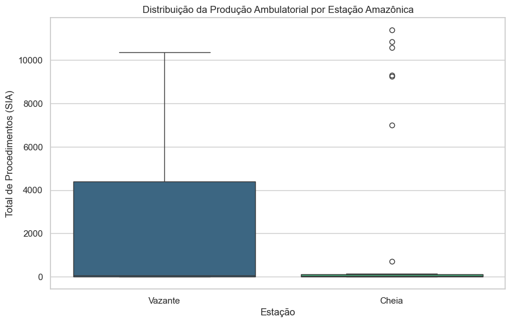
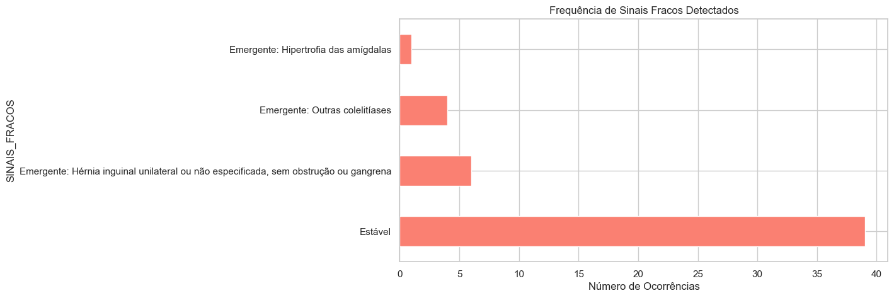
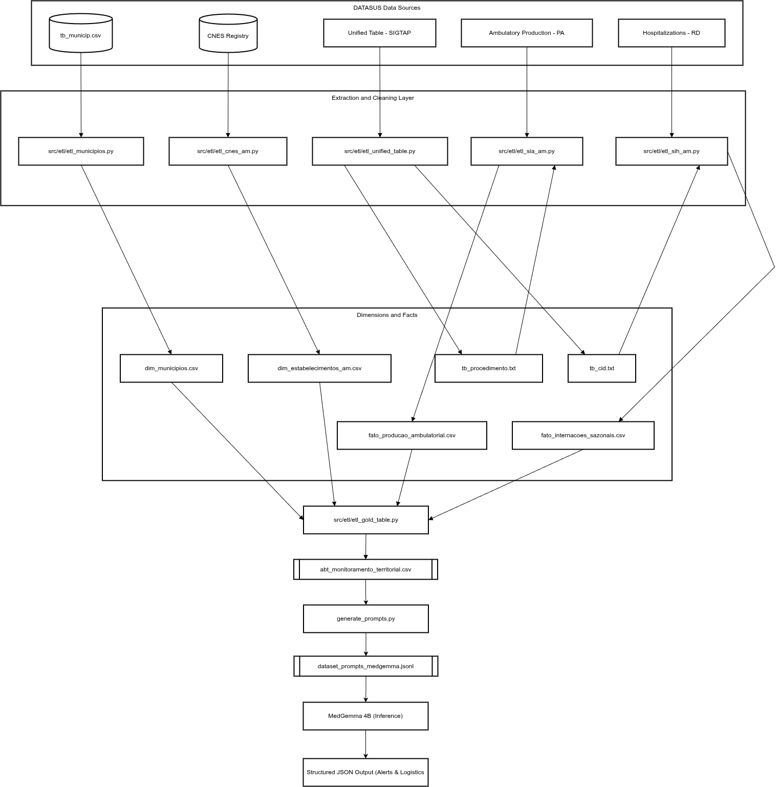

# Sentinela Fluvial (Fluvial Sentinel)
### *Predictive Health Monitoring in the Amazon with MedGemma*

**Status:** Submission for the [MedGemma Impact Challenge](https://www.kaggle.com/competitions/med-gemma-impact-challenge)

---

## Overview

**Sentinela Fluvial** is an AI-driven system designed to combat "data deserts" in the Amazon Rainforest. By combining **Public Health Data (SUS)** with **Hydrological Seasonality Analysis**, we use Google's **MedGemma** LLM to generate actionable, context-aware logistical recommendations for Riverside Basic Health Units (*Unidades Básicas de Saúde Fluviais* - UBSF).

The Amazon's unique geography means that a drop in medical productivity isn't just a management issue—it's often a logistical crisis caused by river levels (*Cheia* vs. *Vazante*). Our solution detects these anomalies and provides explanations and mitigation strategies in natural language.

---

## Exploratory Data Analysis: Validating the "Amazon Factor"

Before deploying Generative AI, we must prove that the variance in our data is driven by geographical realities, not random noise. Our EDA, executed in `notebooks/01_exploratory_analysis.ipynb`, validates our core business hypothesis: **Hydrological seasonality strictly dictates public health access in the Amazon.** 

By proving this, we justify the use of **MedGemma**—traditional static rules (if/else) cannot interpret the logistical nuance of a river drying up, but an instruction-tuned LLM can.

### 1. The Impact of Seasonality on Health Production

* **Critical Insight:** The boxplot distribution of clinical procedures shows a massive variance depending on the `ESTACAO_AMAZONICA` (Vazante/Ebb vs. Cheia/Flood). The statistical asymmetry proves that production drops are not management failures, but seasonal constraints.

### 2. Fluvial vs. Terrestrial Vulnerability

* **Critical Insight:** When comparing Fluvial Units (`IS_UBS_FLUVIAL = True`) to Land Units, it becomes clear that boat-based healthcare suffers extreme operational shifts. This validates our feature engineering and justifies why a generic AI response ("send an ambulance") would fail, whereas our RAG-enhanced MedGemma setup understands the fluvial constraint.

### 3. Clinical Profile and Public Health Risk
<p float="left">
  
  
</p>

* **Critical Insight:** Data science applied to health is about clinical outcomes. The data shows that the drought (*Vazante*) directly impacts critical primary care markers such as Blood Pressure Measurement, Capillary Glycemia, and Rapid Syphilis/HIV Tests. We also mapped emerging "Weak Signals" (e.g., Cholelithiasis outbreaks). By identifying these drops, we feed MedGemma not just raw numbers, but **clinical risks** (e.g., unassisted diabetic patients).

### 4. Anomaly Detection (The RAG Trigger)
To make our system predictive, we calculate the Z-Score of the production volume by municipality. Statistical anomalies (e.g., `Z_PROD < -1.5`, indicating an abrupt drop) act as triggers. This isolates the exact moments where primary care failed due to logistics, transforming tabular anomalies into the rich narrative prompts consumed by MedGemma.

---

## Architecture & Pipeline

Our solution follows a **Bronze-Silver-Gold** data lakehouse architecture, culminating in a Retrieval-Augmented Generation (RAG) approach using MedGemma.



### 1. Data Ingestion (ETL)
We ingest raw data from the Brazilian Unified Health System (DataSUS), specifically:
*   **CNES:** National Registry of Health Establishments (Infrastructure & Bed capacity).
*   **SIA:** Ambulatory Information System (Outpatient procedures).
*   **SIH:** Hospital Information System (Admissions & Diagnostics).

### 2. Feature Engineering (The "Amazon Factor")
We enrich the data with critical local features:
*   **Hydrological Seasonality:** Automatic classification of `Cheia` (Flood) or `Vazante` (Ebb) seasons based on historical patterns.
*   **Unit Type Classification:** Identification of Fluvial Units (Boats) vs. Land Units.
*   **Clinical Memory:** Longitudinal analysis (last 90 days) to detect abrupt drops or outbreaks.

### 3. Generative AI (MedGemma)
The core of the solution. We utilize **MedGemma 4B (Instruction Tuned)** to act as a "Sanitary Doctor".
*   **Input:** Structured JSON containing the unit's context, recent statistics, and seasonal alerts.
*   **Task:** Analyze the correlation between river levels and health production drops/spikes.
*   **Output:** A structured JSON with `situational_analysis`, `priority_recommendations`, and `logistical_strategy` (e.g., "Activate Itinerancy" vs. "Medical Removal").

---

## Repository Structure

```text
.
├── data/
│   ├── raw/                            # Raw CSVs from DataSUS (CNES, SIA, SIH)
│   ├── processed/                      # Cleaned intermediate tables (Silver Layer)
│   └── final/                          # Final prompts for MedGemma (Gold Layer)
├── docs/
│   └── abt_monitoramento_territorial_dict.md  # Data dict
│   └── 01_exploratory_analysis.ipynb   # EDA Health Data
│   └── architecture_diagram.png        #
│
├── src/
│   ├── etl/                            # ETL Pipelines
│   │   ├── etl_cnes_am.py              # Processes Establishment data & Beds
│   │   └── etl_gold_table.py           # Aggregates all data into the Gold Table
│   │   └── etl_municipios.py           # Aggregates all data into the Gold Table
│   │   ├── etl_sih_am.py               # Processes Hospital Admissions
│   │   ├── etl_sia_am.py               # Processes Ambulatory Production
│   │   └── etl_unified_table.py        # Aggregates all data into the Gold Table
│   │
│   └── llm/
│       └── generate_prompts.py         # Context Serialization & Prompt Engineering
│
├── config.py                           # Global configurations (Paths, Constants)
├── requirements.txt                    # Python dependencies
└── README.md                           # Project documentation
```

---

## How to Run

### Prerequisites
*   Python 3.10+
*   Access Kaggle Models (for MedGemma)

### 1. Setup Environment
```bash
# Create a virtual environment
python -m venv venv
source venv/bin/activate  # On Windows use `venv\Scripts\activate`

# Install dependencies
pip install -r requirements.txt
```

### 2. Run the ETL Pipeline
The scripts will download data from PySUS (if not locally available), process it, and create the analytical base table.
```bash
# Process dimensions and facts
python src/etl/etl_municipios.py
python src/etl/etl_cnes_am.py
python src/etl/etl_unified_table.py
python src/etl/etl_sih_am.py
python src/etl/etl_sia_am.py

# Build the Gold Table
python src/etl/etl_gold_table.py
```
### Data Dictionary: Territorial Monitoring ABT (Analytical Base Table)

This document describes the features present in the `abt_monitoramento_territorial.csv` file, which serves as the Gold Layer for public health monitoring in the Amazon Rainforest. This table aggregates dimensional data with clinical facts to feed the MedGemma RAG pipeline.

#### Table Structure

| Column | Description | Data Type | Origin (Primary Source / Script) |
| :--- | :--- | :--- | :--- |
| **COMPETENCIA** | Reference month and year of the data (Format: YYYY-MM). | String | SIH (DT_INTER) and SIA (DT_ATEND) / `build_gold_table.py` |
| **ESTACAO_AMAZONICA** | Hydrological climate classification based on the month (Vazante/Ebb: Months 07 to 11; Cheia/Flood: remaining months). | String | Business Rule / `etl_sih_am.py` and `etl_sia_am.py` |
| **NO_MUNICIPIO** | Friendly name of the municipality in the state of Amazonas. | String | `dim_municipios.csv` (IBGE) / `etl_municipios.py` |
| **NO_ESTABELECIMENTO** | Trade name of the health facility. | String | `dim_estabelecimentos_am.csv` (CNES) / `etl_cnes_am.py` |
| **TOTAL_INTERNACOES** | Total number of hospital admissions registered during the competence month. | Float | SIH/RD (N_AIH) / `build_gold_table.py` |
| **DIAGNOSTICO_PREDOMINANTE** | Friendly name of the pathology (ICD-10) that generated the highest number of admissions in the period. | String | SIH/RD + Unified Table (`tb_cid.txt`) / `etl_sih_am.py` |
| **SINAIS_FRACOS** | Identifies sentinel diseases (e.g., Cholera, Malaria) or the second most frequent diagnosis to detect emerging outbreaks (Weak Signals). | String | Business Rule over SIH/RD / `build_gold_table.py` |
| **INTERNACOES_HIDRICAS** | Sum of admissions for water-borne diseases (ICD-10 codes A00-A09). | Float | SIH/RD (DIAG_PRINC) / `build_gold_table.py` |
| **DOENCA_HIDRICA_PREDOMINANTE** | Name of the most frequent water-borne disease (e.g., Diarrhea, Cholera). | String | SIH/RD + Unified Table (`tb_cid.txt`) / `etl_sih_am.py` |
| **TOTAL_PRODUCAO_AP** | Total volume of Primary Health Care (PHC) procedures performed. | Float | SIA/PA (QT_APROV) / `etl_sia_am.py` |
| **PROCEDIMENTO_AP_PREDOMINANTE** | Name of the most frequently performed Primary Health Care marker procedure in the unit. | String | SIA/PA + Unified Table (`tb_procedimento.txt`) / `etl_sia_am.py` |
| **STATUS_PRESSAO** | Demand pressure classification over the health system (Critical, High, Normal, Indetermined). | String | Calculated via `TAXA_OCUPACAO_ESTIMADA` / `build_gold_table.py` |
| **IS_UBS_FLUVIAL** | Boolean flag indicating whether the facility is river-based (Fluvial Basic Health Unit or Fluvial Emergency Unit). | Boolean | CNES/ST (TP_UNID 32 or 73) / `etl_cnes_am.py` |
| **CAPACIDADE_REAL_SUS** | Corrected number of public beds (Assumes all existing beds are public if management is local and SUS=0). | Float | CNES/LT (`QT_EXIST` vs `QT_SUS`) / `etl_cnes_am.py` |
| **CNES** | National Registry of Health Establishments code (Primary Key). | String | CNES / Primary key across all ETL scripts |
| **PERMANENCIA_MEDIA** | Average length of hospital stay (in days) per patient during the month. | Float | SIH (`DT_SAIDA` - `DT_INTER`) / `etl_sih_am.py` |
| **CODUFMUN** | IBGE code for the municipality (Amazonas state codes start with "13"). | String | CNES/ST and IBGE / `etl_municipios.py` |
| **TP_UNID** | Code representing the type of health unit (e.g., 32=Fluvial UBS, 05=General Hospital). | Float | CNES/ST / `etl_cnes_am.py` |
| **TPGESTAO** | Type of public management (M: Municipal, E: State, D: Dual). | String | CNES/ST / `etl_cnes_am.py` |
| **COD_CEP** | Postal code (ZIP code) of the health establishment. | Float | CNES/ST / `etl_cnes_am.py` |
| **QT_EXIST** | Total number of existing physical beds in the unit. | Float | CNES/LT / `etl_cnes_am.py` |
| **QT_SUS** | Total number of beds officially contracted for the Brazilian Unified Health System (SUS). | Float | CNES/LT / `etl_cnes_am.py` |
| **TAXA_OCUPACAO_ESTIMADA** | Estimated bed occupancy rate (Ratio between monthly admissions and installed capacity). | Float | Calculated (`TOTAL_INTERNACOES` / `CAPACIDADE_REAL_SUS`) / `build_gold_table.py` |

### 3. Generate Prompts for MedGemma
This script reads the Gold Table, applies business rules (e.g., detecting weak signals), and serializes the context into the prompt format expected by MedGemma.
```bash
python src/llm/generate_prompts.py
```
*Output: `data/final/dataset_prompts_medgemma.jsonl`*

---

## MedGemma Integration

We use the **`google/medgemma-4b-it`** model. The prompt engineering strategy focuses on **Few-Shot Learning** and **Chain of Thought (CoT)**.

**Example Prompt Context:**
> "SITUATIONAL SCENARIO: Location: Borba. Season: Vazante (Drought).
> COMPUTATIONAL INTELLIGENCE: Abrupt drop in Syphilis testing (50% below average).
> TASK: Evaluate logistical impact."

**MedGemma Output (JSON):**
```json
{
  "analise_situacional": "A estação Vazante, com rios em nível baixo e acesso difícil, representa um desafio para a realização do teste rápido treponêmico (Sífilis). A sazonalidade da sífilis, que pode aumentar em períodos de maior contato social, é um fator a ser considerado. O histórico recente de 90 dias sem internações ou diagnósticos relevantes sugere que a demanda por testes de sífilis pode ser relativamente estável, mas a dificuldade de acesso pode impactar a cobertura. A prioridade deve ser garantir a acessibilidade e a capacidade de realizar os testes, mesmo com recursos limitados. A baixa demanda, combinada com a dificuldade de acesso, torna o tratamento local a estratégia mais adequada.",
  "recomendacoes_prioritarias": [
    "Fortalecer a logística de transporte para garantir o acesso aos locais de teste, especialmente em áreas de difícil acesso durante a estação Vazante.",
    "Capacitar a equipe para realizar o teste rápido treponêmico (Sífilis) de forma eficiente e garantir a coleta adequada de amostras, mesmo em condições de baixa vazão.",
    "Realizar campanhas de conscientização sobre a importância do teste rápido treponêmico (Sífilis) para a população local, destacando os riscos da sífilis e a facilidade de acesso ao teste."
  ],
  "nivel_alerta": "Baixo",
  "estrategia_logistica": "Tratamento Local"
}
```

---

## License

This project is open-source and available under the MIT License. The data used belongs to the Brazilian Ministry of Health (public domain). Use of MedGemma is subject to the **HAI-DEF Terms of Use**.

---

### Team
*   Richardson Allan Ferreira de Souza - Data Scientist & AI Engineer

---
*Built with 💙 for the Amazon.*