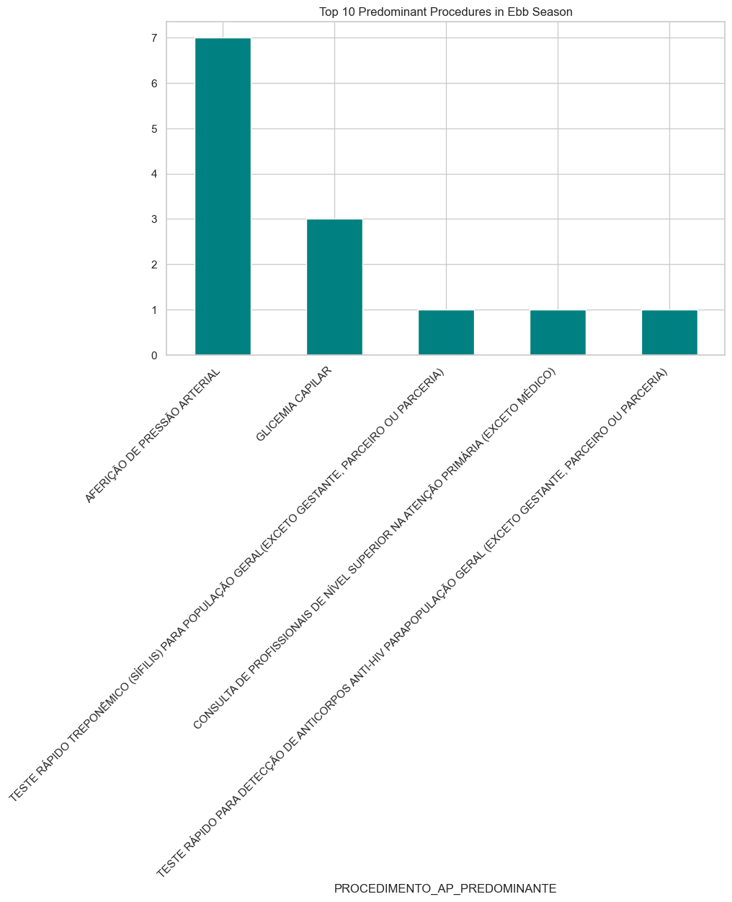

### Kaggle Writeup Submission

#### **Project name**
**Sentinela Fluvial (Fluvial Sentinel): Predictive Health Monitoring in the Amazon with MedGemma**

#### **Your team**
*   **Richardson Allan Ferreira de Souza** - Data Scientist & AI Engineer (ETL Pipeline, Prompt Engineering, and LLM Integration).

#### **Problem statement**
**The Unmet Need in the Amazonian Data Desert**  
The Brazilian Amazon relies heavily on Riverine Basic Health Units (UBSF - *Unidades Básicas de Saúde Fluviais*) to deliver primary care to isolated communities. However, traditional health management dashboards fail in this territory because they operate under an urban bias, completely ignoring the **Amazonian hydrological cycle**. 

As proven by our Exploratory Data Analysis (EDA), this is not merely a logistical inconvenience, but a measurable clinical barrier. Our statistical analysis reveals a massive variance and asymmetry in ambulatory production depending on the *Vazante* (dry) and *Cheia* (flood) seasons.
When segmenting the data, Fluvial Units show extreme operational vulnerability, suffering abrupt production drops that terrestrial units do not experience. 

A sudden 90% drop in clinical output in an urban center might indicate low demand or a holiday; in the Amazon, our data shows that during extreme seasons, critical primary care markers—such as Capillary Glycemia and Rapid Syphilis/HIV Testing—plummet abruptly. This means chronic patients are physically blocked from receiving life-saving care, and infectious outbreaks go undetected. The "data desert" is thus created by physical isolation, requiring a system capable of understanding that a tabular statistical anomaly (e.g., zero tests performed) is actually a geographical crisis requiring immediate, alternative logistical action.

**Magnitude and Impact**  
Currently, public health management in the Amazon operates retroactively, analyzing tabular data (DataSUS) months after a crisis has occurred. *Sentinela Fluvial* shifts this to a predictive, action-oriented paradigm. Our data reveals the true magnitude of this "data desert": logistical constraints during extreme seasons cause abrupt, near-total collapses in primary care. For instance, our pipeline detected a 98% drop in Primary Care Consultations in Manicoré during extreme floods (*Cheia*), and a severe halt in Capillary Glycemia and Rapid Syphilis/HIV Testing in communities like Tefé and Barreirinha during severe droughts (*Vazante*).

The impact of ignoring these anomalies is life-threatening. The interruption of continuous care for chronic patients (e.g., unmonitored diabetics) and the suspension of infectious disease screening inevitably lead to severe complications and preventable hospitalizations, known as Primary Care-Sensitive Conditions (CSAP). 

By leveraging MedGemma to cross-reference statistical drops with environmental constraints, we translate tabular anomalies into immediate clinical and logistical interventions. When the AI recommends activating "Itinerancy" (deploying small draft boats) because a Fluvial Unit cannot dock due to low river levels, it directly optimizes the region's scarce financial resources and prevents logistical bottlenecks from evolving into public health tragedies.

#### **Overall solution:**  
**Context-Aware Clinical Logistics with MedGemma**  
While large, closed-source models require constant internet access to function, health outposts in the Amazon operate in disconnected, low-bandwidth environments. To solve this, we utilized the **`google/medgemma-4b-it`** open-weights model. Its lightweight architecture (4B parameters) allows it to be deployed on local edge servers at municipal health secretariats, ensuring privacy and offline operational capability, while possessing the deep clinical instruction-tuning necessary to understand complex public health dynamics.

Our architecture is a hybrid RAG (Retrieval-Augmented Generation) pipeline:
1. **Trigger (The "What"):** A deterministic Python algorithm continuously monitors DataSUS tables. When it detects a statistical anomaly—such as the 98% drop in Primary Care Consultations we identified in Manicoré—it triggers the AI pipeline. 
2. **Reasoning (The "Why" and "How"):** The tabular anomaly is injected into a Few-Shot structured prompt, enriched with the `ESTACAO_AMAZONICA` (Vazante or Cheia) variable. MedGemma acts as a "Virtual Sanitary Doctor," cross-referencing clinical drops with geographic constraints.

**Effective Use of HAI-DEF and Why MedGemma?**
A generic static rule (if/else) cannot interpret logistical nuance. A standard LLM, on the other hand, might hallucinate and suggest "dispatching an ambulance" to a flooded jungle community. MedGemma, guided by our engineered context, generates highly specific, actionable, and safe public health interventions outputted strictly as a **JSON object** for seamless dashboard integration.

*Proof of Capability (Real outputs from our pipeline):*
* **In Tefé (Vazante/Severe Drought):** Faced with an abrupt drop in Capillary Glycemia tests, MedGemma correctly deduced that diabetic patients were isolated. Instead of simply suggesting to "send a boat," it recommended *"implementing a remote monitoring system with portable devices for patients who cannot be attended in person due to logistics"* and utilizing local community agents.
* **In Novo Aripuanã (Cheia/Extreme Floods):** Faced with submerged docks, the model understood the geographical barrier and outputted `Itinerância` (Itinerancy) as the `logistical_strategy`, specifically advising managers to deploy *"adapted draft boats to navigate deep waters and perform Rapid Syphilis Tests in floating health posts."*

This demonstrates that MedGemma is not just summarizing text; it is actively resolving the friction between clinical necessity and Amazonian logistical reality.

#### **Technical details**  
**Product Feasibility, Architecture, and Execution**

To ensure high product feasibility within the constraints of the Brazilian Unified Health System (SUS), *Sentinela Fluvial* avoids monolithic Blackbox AI designs. Instead, we built a modular pipeline combining deterministic data engineering with the generative reasoning of MedGemma.

  
   <i>Our modular Bronze-Silver-Gold pipeline, extracting DATASUS data to systematically generate the Tabular RAG prompts.</i>

**1. Data Engineering Pipeline (Bronze to Gold Layer):**
Using Python and `pandas`, we extract raw public health files (CNES, SIA, and SIH) and process them through a Bronze-Silver-Gold architecture. The final output is the `abt_monitoramento_territorial.csv` (Analytical Base Table). Here, we engineer critical domain-specific features: 
* We calculate Z-scores to detect statistical anomalies.
* We cross-reference unit IDs to flag `IS_UBS_FLUVIAL` (Riverside Units) and classify the `ESTACAO_AMAZONICA` (Vazante or Cheia) based on the timestamp.
* We engineer the `STATUS_PRESSAO` (System Pressure) metric by correlating bed capacity (`CAPACIDADE_REAL_SUS`) with admission volumes.

<figure>
  
  <figcaption>Classical statistics (Z-score) computationally isolates access failures (marked by the red X in September 2025). Only the dataframe rows containing these anomalies are activated as triggers. They are sliced and transformed into 'Computational Intelligence' within the MedGemma prompt, ensuring cost efficiency and precise focus for the LLM.</figcaption>
</figure>

**2. Context Serialization (Tabular RAG):**
Large models struggle with raw tabular data. We developed a Python middleware (`generate_prompts.py`) that acts as a bridge. It reads the Gold Table and constructs a highly structured Few-Shot Prompt. It injects a "90-day Clinical Memory" and explicit "Epidemiological Intelligence" (e.g., *LOW WATER CONTEXT: Rivers at low level. Difficult access*). This hybrid approach relies on Python for deterministic fact-checking and MedGemma for semantic reasoning, virtually eliminating contextual hallucinations.

**3. Instruction Tuning and JSON Enforcement:**
We utilized the `google/medgemma-4b-it` model. To ensure seamless frontend integration (e.g., React/Streamlit dashboards), we applied strict prompt engineering instructions that force the LLM to output exclusively in a predefined JSON format.

**4. Explainable AI (XAI) via Chain of Thought:**
In healthcare, accountability is non-negotiable. Our JSON schema includes a `situational_analysis` field. Before outputting the final `alert_level` or `logistical_strategy`, MedGemma must write out its clinical reasoning. This acts as a Chain of Thought (CoT) mechanism, providing health managers with an interpretable audit trail of *why* the AI recommended deploying a specific boat or initiating remote monitoring. 

Because the entire inference logic runs on the lightweight 4B parameter MedGemma model, this pipeline can be containerized (Docker) and deployed on local municipal servers (Edge AI), guaranteeing high availability and strict patient data privacy without requiring continuous cloud API connections.

